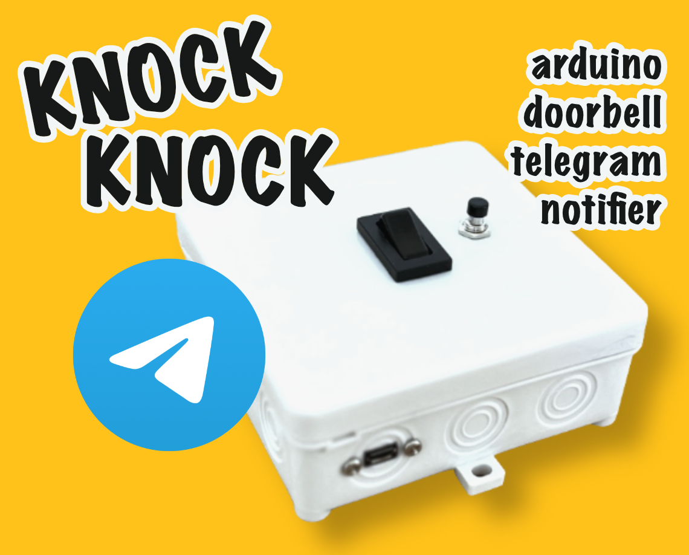

# Knock Knock – An Arduino doorbell Telegram notifier

In order to **monitor my doorbell** – an old mechanical one that is loud but only hearable in one room – I needed a solution. I wanted to use the **least amount of third party code**. Secondly, because passwords are involved and **privacy** is important to me, I needed a solution to hook into an existing system that does not need to have my data stored in an IFTTT like website. But the setup and maintenance **effort** should be **minimal**. I wanted to have a **local**, **anonymized** solution. It also had to be **non intrusive** as I did not want to open the doorbell or hook into it physically.

This contraption is positioned close to a doorbell and will **send a Telegram message** once the doorbell **rings**.

The device is an **external addition** thus does **not interfere** with the doorbell circuit making this an easy add on for any situation where the doorbell hardware **must not be altered**. It is also a good beginners Arduino electronics project as the device is encapsulated in a box that only works with low voltages. Being **battery** powered it can be activated on demand. To make the most out of the 1400 mAh battery the device goes into **deep sleep** after one hour and can be easily **reactivated** via the push button.

## Hardware

- [D1 mini NodeMcu](https://amzn.eu/d/bRZUzQS)
- [Battery shield](https://amzn.eu/d/7YD7yM4)
- [Lithium polymer battery](https://amzn.eu/d/bhiaD2f)
- [Sound sensor](https://amzn.eu/d/gCLL4w8)
- [Rocker switch](https://amzn.eu/d/2by1sVT)
- [Push button](https://amzn.eu/d/3Mczbjj)
- [USB panel mount cable](https://amzn.eu/d/bcRj1g8)
- [Junction box](https://www.bauhaus.info/schalterdosen-deckel/abzweigdose/p/12148764)

### Wiring

Have a look at the [wiring diagram](Screenshots/wiring_diagram.jpg) first.

1. Strategically **mount** the `rocker switch` and the `push button` in the `junction box`. Use a cutter to **cut openings** in the box and **pressfit** both devices.
2. Strategically **route** the `USB panel mount cable` to the surface of the `junction box` (used to charge the system without opening the box). The linked model is secured with screws.
3. Strategically **mount** the `battery` in the `junction box` (VHB tape works well).
4. **Desolder** the female JST connector on the `battery shield` and **solder** extension cables between the female JST connector leads and the `battery shield` terminals. This is a good point to **check polarity** of the JST connectors and the battery: some batteries have the JST connector soldered on the other way!
5. **Wire** the `rocker switch` in between the **positive lead** going from the female JST connector to the **positive terminal** of the battery shield (ensure enough wire for routing).
6. **Wire** the `push button` in between `RST` and `GND` of the microcontroller (ensure enough wire for routing).
7. Strategically **wire** the `sound sensor` to `A0`, `3V3` and `GND` of the microcontroller (ensure enough wire for routing).
8. **Drill** small holes to the back of the `junction box` and hot glue the `sound sensor` to that position with the microphone facing the backside of the box.
9. **Mount** the `battery shield` on the `D1 mini NodeMcu`.
10. **Connect** the `USB panel mount cable` to the `battery shield`.
11. **Connect** the battery to the female **JST connector**.
12. **Tidy up** all cables and ensure correct spacing when closing the box.

You're done setting up the hardware.

## Software

### Telegram setup

The setup follows these [instructions](https://sarafian.github.io/low-code/2020/03/24/create-private-telegram-chatbot.html). For simplicity I tried to compress it even more in the following step by step list:

1. **Create** a Telegram bot using [@botfather](https://web.telegram.org/k/#@BotFather) ([FAQ](https://core.telegram.org/bots/faq)).
   - Username: `@<NAME>Bot`
   - Disable `Allow Groups?`
   - Turn on `Group Privacy`
   
   The bot `Token` will be available once the bot is created. Write it down, you'll need it in a later step.
2. **Create** a **private** group.
   - Group name: `MyPrivateGroup`
   - Group Type: `private`
   
   Warning: **Do not** edit special permissions for users as this will [convert the group into a supergroup](https://stackoverflow.com/a/62291433) which **does not work** with this code.
3. Temporarily **enable** `Allow Groups?` on the bot.
4. **Add** the bot to the group.
5. Immediately **deactivate** `Allow Groups?` on the bot after adding it to the group.
6. **Post** a test message into the group via the app or the browser (required to get the next step running).
   Start message with `/` in order for the bot to be able to read it (`Group Privacy` is turned on by default).
7. **Retrieve** group `chat_id` by visiting `https://api.telegram.org/bot<BOT_TOKEN>/getUpdates` in the browser.
8. Let the bot **send** a test message via visiting `https://api.telegram.org/bot<BOT_TOKEN>/sendMessage?chat_id=<GROUP_CHAT_ID>&text=Test` in the browser.
    The message should appear in the group chat.

You're done setting up the Telegram infrastructure.

### Setup credentials

1. Either **rename** [passwords_template.h](Arduino/knock_knock/passwords_template.h) to `passwords.h` or **copy** its content to a new file named `passwords.h` in the same folder.
2. **Enter** your WiFi and Telegram **credentials** in `password.h`.

### Adjust settings

The system can be **fine tuned** according to your needs by adjusting the **properties** in [settings.h](Arduino/knock_knock/settings.h).

#### `DEBUG`

If `true` prints verbose debug statements via serial connection. Useful for finding issues with e.g. the WiFi connection.

Default `false`.

#### `NOTIFY_UPCOMING_DEEP_SLEEP`

If `true` sends a Telegram message after `RUNTIME_BEFORE_UPCOMING_DEEP_SLEEP_NOTIFICATION_IN_MILLISECONDS` announcing the upcoming deep sleep in `RUNTIME_BEFORE_DEEP_SLEEP_IN_MILLISECONDS`.

Default `true`.

#### `NOTIFY_DEEP_SLEEP`

If `true` sends a Telegram message after `RUNTIME_BEFORE_DEEP_SLEEP_IN_MILLISECONDS` announcing the immediate deep sleep.  

Default `true`.

#### `SILENTLY_NOTIFY_PROJECT_STARTUP`

If `true` sends the 'project startup' Telegram message silently. Users will receive a notification with no sound.

Default `true`.

#### `SILENTLY_NOTIFY_DOORBELL_RINGING`

If `true` sends the 'doorbell ringing' Telegram message silently. Users will receive a notification with no sound.

Default `false`.

#### `SILENTLY_NOTIFY_UPCOMING_DEEP_SLEEP`

If `true` sends the `NOTIFY_UPCOMING_DEEP_SLEEP` Telegram message silently. Users will receive a notification with no sound.

Default `false`.

#### `SILENTLY_NOTIFY_DEEP_SLEEP`

If `true` sends the `NOTIFY_DEEP_SLEEP` Telegram message silently. Users will receive a notification with no sound.

Default `false`.

#### `RUNTIME_BEFORE_UPCOMING_DEEP_SLEEP_NOTIFICATION_IN_MILLISECONDS`

The system will remain functional for this time until deep sleep is announced.

Default `55 minutes`.

#### `RUNTIME_BEFORE_DEEP_SLEEP_IN_MILLISECONDS`

The system will go to deep sleep after this time.

Default `1 hour`.

#### `NOTIFICATION_LOCK_IN_MILLISECONDS`

The system will **not** send a Telegram message but **raise the _notification importance level_** during this lock period.
This is so that we stay within the [api limits](https://core.telegram.org/bots/faq#my-bot-is-hitting-limits-how-do-i-avoid-this).

Default `1 minute`.

#### `NOTIFICATION_RETRIES`

Number of attempts to connect to the Telegram server.

Default `3`.

#### `SAMPLE_WINDOW_WIDTH_IN_MILLISECONDS`

50 ms being 20 Hz.

Default `50`.

#### `SOUND_THRESHOLD`

If this value is exceeded we assume that the doorbell rings. You might want to test different settings while performing typical sounds in the area you setup this device such as talking loudly or letting a phone ring.

Default `973`.

#### `PROJECT_STARTUP_MESSAGE`

The message being sent via the Telegram bot when the project is ready.

Default `\xF0\x9F\x91\x82` (👂 emoji).

#### `DOORBELL_RINGING_MESSAGE`

The message being sent via the Telegram bot when the doorbell rings.

Default `Knock Knock`.

#### `UPCOMING_DEEP_SLEEP_MESSAGE`

The message being sent via the Telegram bot notifying that deep sleep starts in `RUNTIME_BEFORE_DEEP_SLEEP_IN_MILLISECONDS` - `RUNTIME_BEFORE_UPCOMING_DEEP_SLEEP_NOTIFICATION_IN_MILLISECONDS`.

Default `\xF0\x9F\x98\xA9` (😴 emoji).

#### `DEEP_SLEEP_MESSAGE`

The message being sent via the Telegram bot when the project is going into deep sleep after `RUNTIME_BEFORE_DEEP_SLEEP_IN_MILLISECONDS`.

Default `\xF0\x9F\x92\xA4` (💤 emoji).

### Flashing the code

1. **Download** and **install** the latest release of [Arduino IDE](https://www.arduino.cc/en/software).
2. Download the latest release of [knock-knock-arduino-doorbell-telegram-notifier](https://github.com/mayrs/knock-knock-arduino-doorbell-telegram-notifier).
3. Open `Arduino/knock_knock/knock_knock.ino`.
4. In the **Tools menu** select the board `LOLIN(WEMOS) D1 R2 & mini` for flashing. There is a [tutorial](https://randomnerdtutorials.com/how-to-install-esp8266-board-arduino-ide/) on how to install ESP8266 boards in Arduino IDE.
5. Set `Upload Speed: 921600` and `CPU Frequency: 80 MHz`.
6. **Connect** to the board via USB (**not** to the battery shield USB that is routed to the outside of the enclosure!).
7. Choose the correct **USB** `Port` for uploading.
8. Hit `Upload` in the Arduino IDE and wait for the process to **successfully finish**.
9. **Unplug** the USB cable and **close** the box making sure that all cables are **spaced correctly**.

### Anonymization

The bot (`@<NAME>Bot`) can be found by **any** Telegram user. It exposes no methods to the public so there is **no interaction** with other users. By using the bot [`Token`](https://core.telegram.org/bots/api#authorizing-your-bot) we can send messages to certain channels in the name of the bot. Again, this data will **never be shared** with other users.

To anonymize the bot output – and increase the cuteness factor – we use [emojis](https://apps.timwhitlock.info/emoji/tables/unicode).

#### System startup

`ear` emoji.

#### Doorbell detected

`Knock Knock` appended by 0-3 exclamation marks (aka __notification importance level__).

1. `Knock Knock` – Doorbell rang once
2. `Knock Knock!` – Doorbell rang once, subsequently twice within the last minute
3. `Knock Knock!!` – Doorbell rang once, subsequently three times within the last minute
4. `Knock Knock!!!` – Doorbell rang once, subsequently four times within the last minute

#### System preparing for deep sleep

`weary face` emoji.

#### System about to enable deep sleep

`sleeping symbol` emoji.

### Program flow

1. **Activate** rocker switch.
2. System **boots** and **broadcasts** readiness via Telegram.
3. Code **runs**.
   1. It **reports** a **ringing doorbell** via Telegram.
   2. It **reports** the **upcoming shutdown** after `RUNTIME_BEFORE_UPCOMING_DEEP_SLEEP_NOTIFICATION_IN_MILLISECONDS` of runtime via Telegram.
   3. It **reports** going to **deep sleep** after `RUNTIME_BEFORE_DEEP_SLEEP_IN_MILLISECONDS` of runtime via Telegram.
      1. It **goes into deep sleep** after `RUNTIME_BEFORE_DEEP_SLEEP_IN_MILLISECONDS` of runtime.
4. It can be **woken up** from deep sleep via the **push button** (code starts again at #2).
5. The **power is cut** via deactivation of the rocker switch.

## Acknowledgement

Thanks [Alex Sarafian](https://github.com/Sarafian) for providing great instructions on how to [Creating a private Telegram chatbot
](https://sarafian.github.io/low-code/2020/03/24/create-private-telegram-chatbot.html).

Thanks [zenmanenergy](https://github.com/zenmanenergy) for the [URL encoding sketch](https://github.com/zenmanenergy/ESP8266-Arduino-Examples/blob/master/helloWorld_urlencoded/urlencode.ino).

And also a great thanks to all people that posted and discussed on various webpages about coding, esp8266 and so on. Wouldn't have made it without you.
